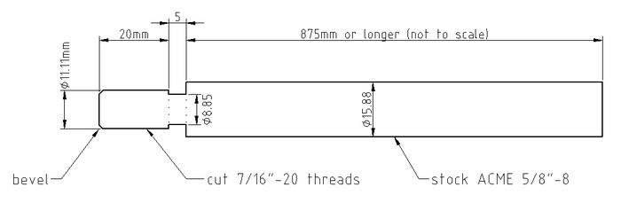

Introduction
============

The 2D LibreCAD file ``long_reamer_facer.dxf`` contains a static design for an
extra long reamer/facer rod attachment for use with cargo bike head tubes or
any other long head tube.  It is intended to work with the Park Tool HTR-1(B)
head tube reamer/facer set.

The document ``long_reamer_facer.pdf`` contains the final drawing, print this
for your reference at the machine shop.

Here is a preview of the current design:

Design Notes
============

The design is currently a WORK IN PROGRESS.  It has not been tested.

Materials
=========

- 3ft (or longer) length of ACME 5/8-8 steel or stainless rod.  This will do:
  https://www.mcmaster.com/#98935a829

Instructions
============

#) secure access to a large lathe, collet chuck, draw bar, and 5/8" collet.
#) chuck the ACME rod in the collet with about 1.5ft stickout.
#) drill a center hole on the end of the rod and secure the end with a live
   center.
#) install cutter for turning while feeding towards the left.
#) turn down a 27mm length from the end to ⌀11.11mm.
#) install cutter for grooving:
   - side relief on both left and right sides.
   - 8° end relief
   - 0° side rake
   - 10° back rake
#) groove a 5mm segment to ⌀8.85mm.  Make sure the step between the grooved
   ⌀8.85mm segment and stock diameter is faced.
#) install cutter for turning while feeding towards the left.
#) turn down the entire length of exposed ACME thread to ⌀15.48mm.
#) if you have DRO, zero your X axis.
#) pull back the live center and face off about 2mm from the end.
#) make a small bevel on the end.
#) remove the ACME rod from the collet and reinsert it the other way.  Grab it
   in the collet on a turned segment, but near the transition to factory
   finish.  This is not super great for the collet, but oh well.
#) drill center hole and stabilize rod end with live center.
#) turn the entire exposed surface to ⌀15.48mm, or X position zero if you have
   a DRO.

Software
========

The design was developed using LibreCAD 2.0.4 (for the drawing) and FreeCAD
0.17 (for the initial outline).

License
=======

This is essentially a copy of the Park Tool HTR-1 shaft with a slight
modification (longer ACME threaded section).  Therefore, I can't claim any
ownership of the design, nor anybody else unaffiliated with Park Tool.
