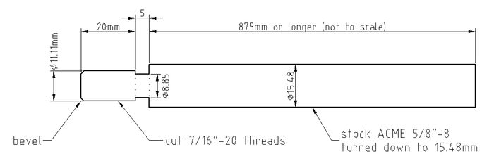

Introduction
============

The 2D LibreCAD file ``long_reamer_facer.dxf`` contains a static design for an
extra long reamer/facer rod attachment for use with cargo bike head tubes or
any other long head tube.  It is intended to work with the Park Tool HTR-1(B)
head tube reamer/facer set.

The document ``long_reamer_facer.pdf`` contains the final drawing, print this
for your reference at the machine shop.

Here is a preview of the current design:

Design Notes
============

The design is currently a WORK IN PROGRESS.  It has not been tested.

Instructions
============

TODO.

Software
========

The design was developed using LibreCAD 2.0.4 (for the drawing) and FreeCAD
0.17 (for the initial outline).

License
=======

Copyright © 2017 Troy Sankey <sankeytms at gmail dot com>

This documentation describes Open Hardware and is licensed under the CERN OHL
v1.2.  You may redistribute and modify this documentation under the terms of
the CERN OHL v1.2 (http://ohwr.org/cernohl). This documentation is distributed
WITHOUT ANY EXPRESS OR IMPLIED WARRANTY, INCLUDING OF MERCHANTABILITY,
SATISFACTORY QUALITY AND FITNESS FOR A PARTICULAR PURPOSE.  Please see the CERN
OHL v1.2 for applicable conditions.
